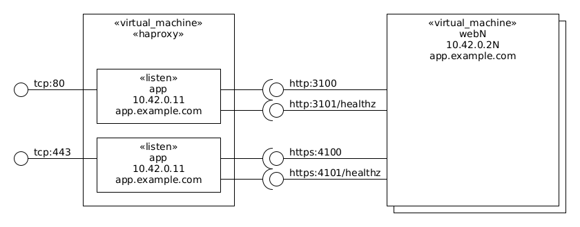

This is a haproxy active-passive load balancer.

Each node has the following components and connections:



# Usage

Build and install the [Ubuntu 18.04 Base Box](https://github.com/rgl/ubuntu-vagrant).

Add the following entries to your `/etc/hosts` file:

```
10.42.0.10 lb.example.com
10.42.0.11 app1.example.com
10.42.0.12 app2.example.com
```

Run `vagrant up --provider=libvirt` (or `--provider=virtualbox`) to launch everything.

Show the statistics from within the machine:

```bash
vagrant ssh lb
sudo su -l
echo 'show stat' | nc -U /run/haproxy/admin.sock
```

Or access the [statists web page](http://10.42.0.10:9000).

# Reference

 * [Emulating Active/Passing Application Clustering with HAProxy](https://www.haproxy.com/blog/emulating-activepassing-application-clustering-with-haproxy/)
 * [HAProxy Documentation](http://www.haproxy.org/#docs)
 * [HAProxy 1.8 Configuration Reference](http://cbonte.github.io/haproxy-dconv/1.8/configuration.html)
